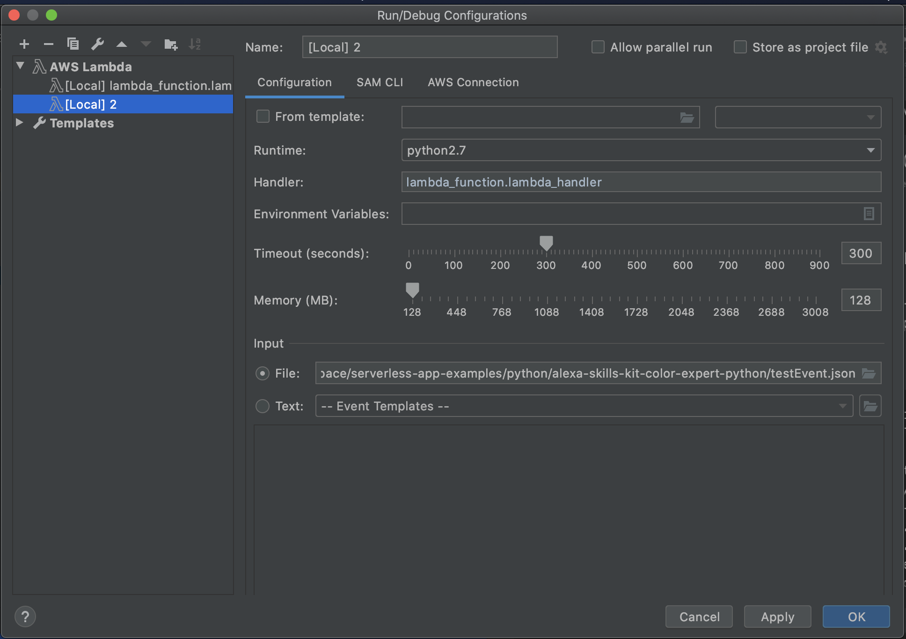

# Alexa Skill - Fav Colour Picker :art:

[Guide](https://github.com/alexa/skill-sample-python-colorpicker)

### Local config

- Download AWS Toolkit plugin for PyCharm
- Set AWS credentials Profile (bottom right on PyCharm)
- Have Docker installed and running

### SAM CLI Installation
```bash
brew tap aws/tap
brew install aws-sam-cli
sam --version
```
[Getting started guide - Hello world](https://docs.aws.amazon.com/serverless-application-model/latest/developerguide/serverless-getting-started-hello-world.html)
### CL commands
```bash
sam build
sam deploy --guided
sam local invoke -e testEvent.json
```
Once deployed, the ARN code (AWS console > Lambda > Functions > Color picker function > top right corner) needs to be copied and pasted in the Alexa Skill endpoint page.

### Run locally in PyCharm using testEvent.json
- PyCharm should detect a Lambda run configuration - if it doesn't, create one 
- Select testEvent.json as Input file



Sample run output:
```bash
/usr/local/bin/sam local invoke --template /Users/mpancaldi/Workspace/serverless-app-examples/python/alexa-skills-kit-color-expert-python/.aws-sam/build/template.yaml --event "/private/var/folders/fq/d4f0jv117bd3mh8vqr_qn4980000gn/T/[Local] 2-event.json"
Invoking lambda_function.lambda_handler (python2.7)

Fetching lambci/lambda:python2.7 Docker container image......
Mounting /Users/mpancaldi/Workspace/serverless-app-examples/python/alexa-skills-kit-color-expert-python/.aws-sam/build/Function as /var/task:ro,delegated inside runtime container
START RequestId: 5b9fe3cd-eed7-1f1c-41cf-648714d87e86 Version: $LATEST
event.session.application.applicationId=amzn1.ask.skill.987654321
on_intent requestId=amzn1.echo-api.request.1234, sessionId=amzn1.echo-api.session.123456789012
END RequestId: 5b9fe3cd-eed7-1f1c-41cf-648714d87e86
REPORT RequestId: 5b9fe3cd-eed7-1f1c-41cf-648714d87e86	Init Duration: 81.27 ms	Duration: 2.90 ms	Billed Duration: 100 ms	Memory Size: 128 MB	Max Memory Used: 22 MB	

{"version":"1.0","response":{"outputSpeech":{"text":"I now know your favorite color is blue. You can ask me your favorite color by saying, what's my favorite color?","type":"PlainText"},"shouldEndSession":false,"reprompt":{"outputSpeech":{"text":"You can ask me your favorite color by saying, what's my favorite color?","type":"PlainText"}},"card":{"content":"SessionSpeechlet - I now know your favorite color is blue. You can ask me your favorite color by saying, what's my favorite color?","type":"Simple","title":"SessionSpeechlet - MyColorIsIntent"}},"sessionAttributes":{"favoriteColor":"blue"}}
```